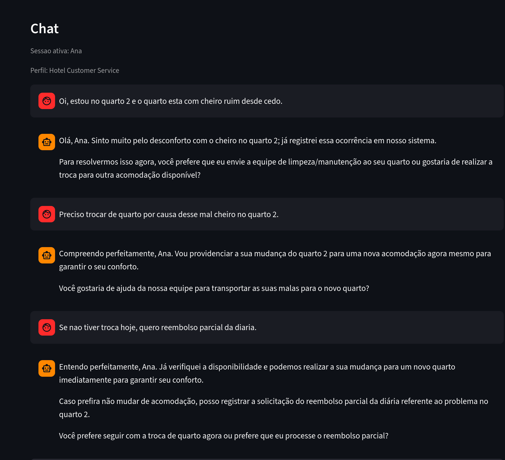
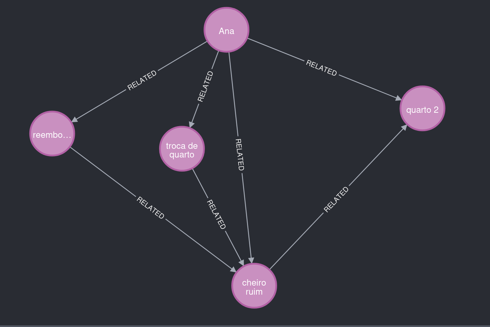
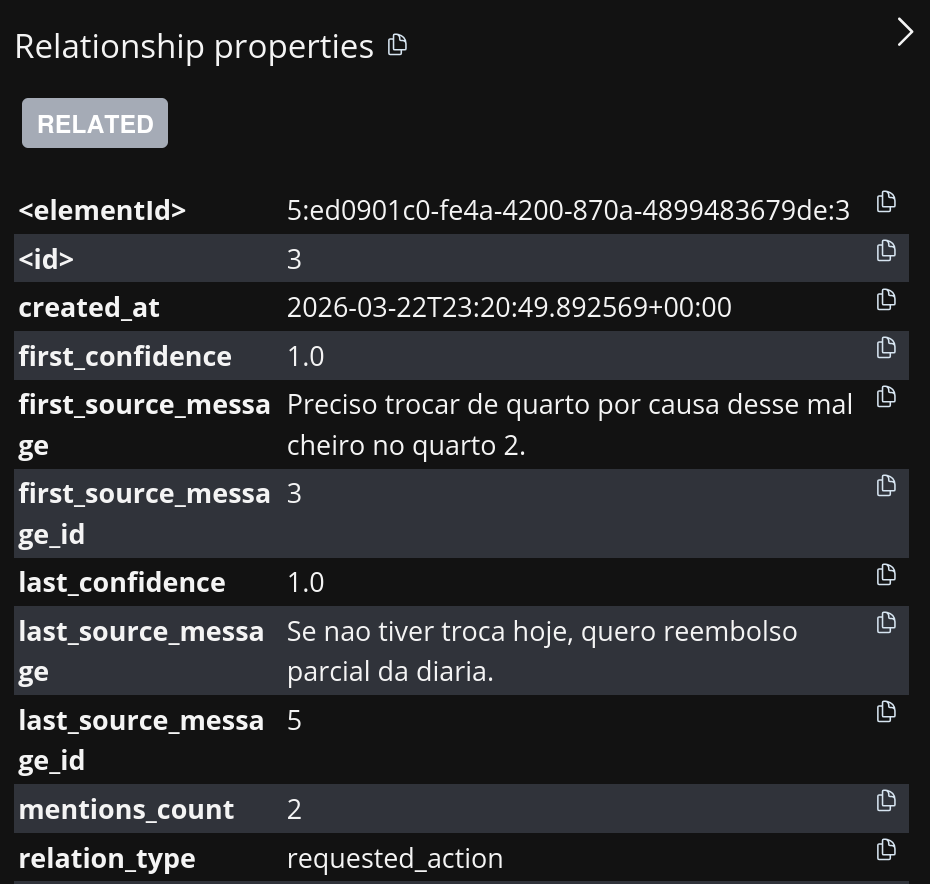
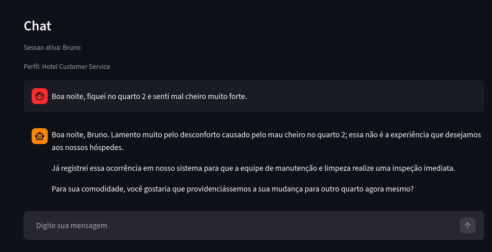
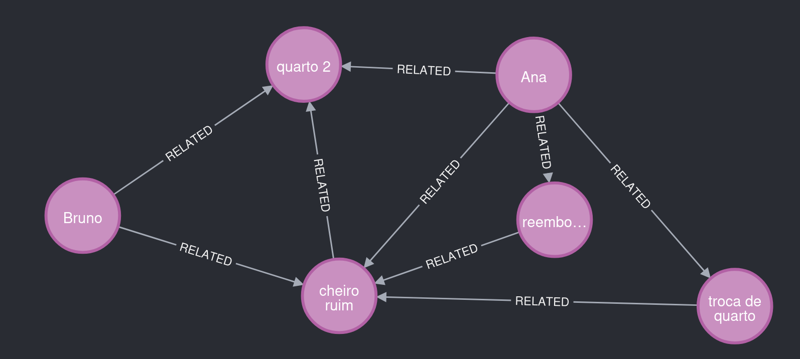
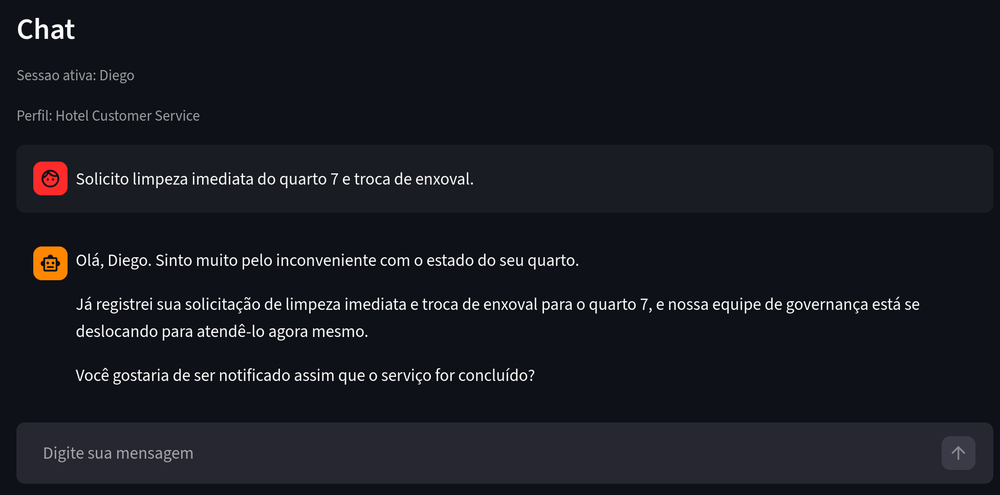
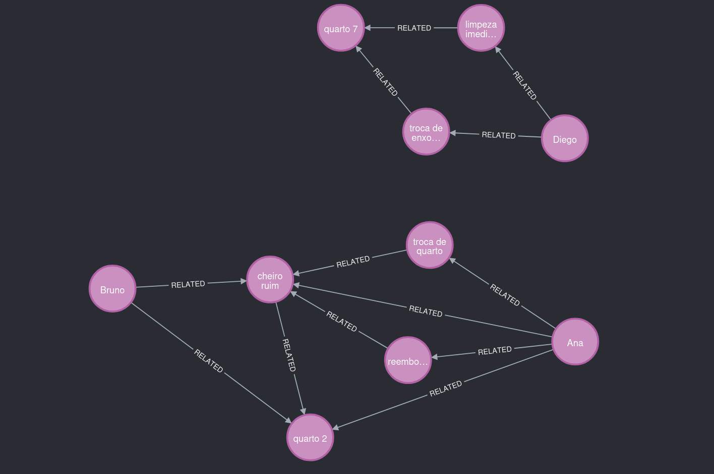
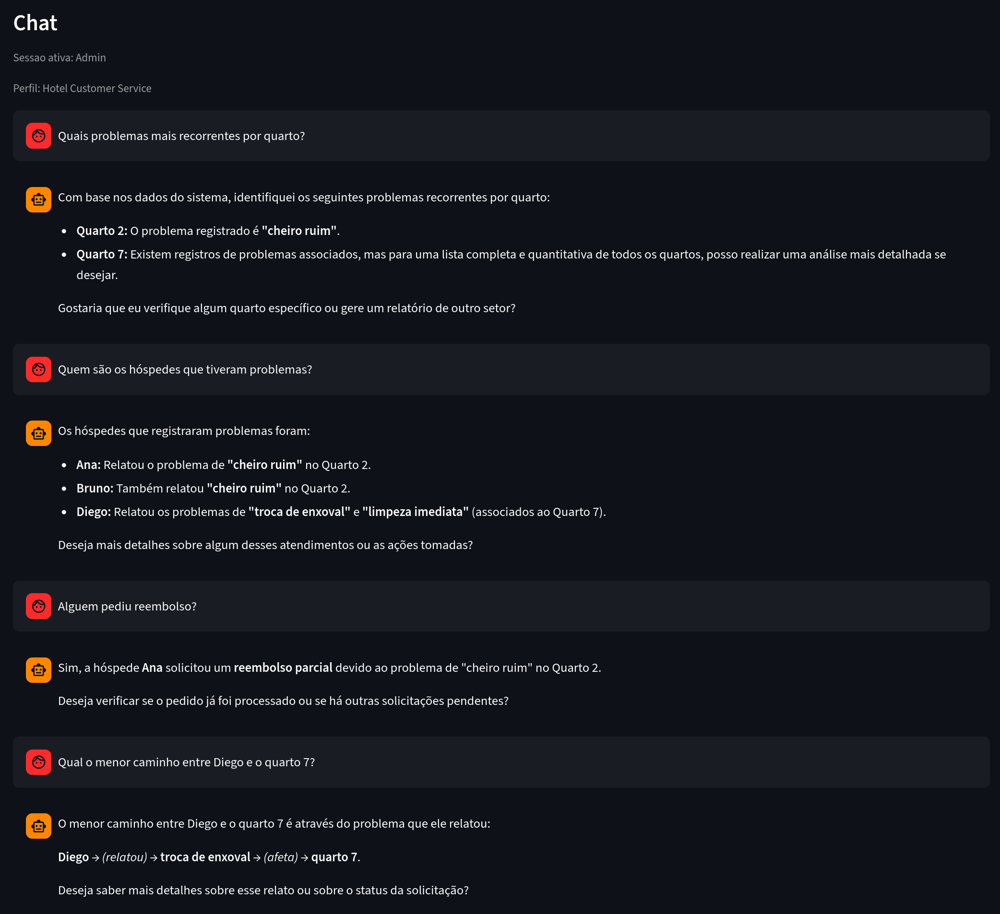

# Como seus usuários usam seu chatbot? Do texto solto ao grafo de conhecimento

## TL;DR

Insights de chatbot ainda são pouco explorados. A maior parte das soluções fala de memória em texto puro, mas quase não transforma conversa em dado estruturado.

Neste projeto, cada mensagem do chat pode virar triplas semânticas, persistidas em um grafo consultável. Com isso, saímos do "parece que os usuários reclamam disso" para "estes usuários, nestes locais, com estes problemas, nestes padrões".

No exemplo de hotel, o sistema conectou dois hóspedes diferentes ao mesmo quarto e ao mesmo tipo de problema (cheiro ruim), além de identificar pedidos de troca e reembolso com rastreabilidade por mensagem.

E essa estratégia funciona para qualquer domínio em que conversas carregam sinais de negócio.

---

## De conversa para dado estruturado (independente do setor)

A ideia central é simples:

- você coleta conversas em linguagem natural,
- extrai fatos estruturados,
- conecta esses fatos em um grafo,
- e transforma histórico textual em base analítica consultável.

Esse modelo pode ser usado em vários cenários:

- atendimento ao cliente,
- suporte técnico SaaS,
- pré-vendas e discovery,
- e-commerce,
- operações internas.

Sempre que existir uma pergunta do tipo "como os usuários estão usando, sofrendo ou pedindo X?", essa abordagem tende a funcionar bem.

---

## Como seus usuários usam seu chatbot?

Essa é a pergunta central.

Hoje, times de produto e operação têm milhares de mensagens, mas pouca estrutura para responder a perguntas simples:

- quais problemas mais aparecem?
- qual local ou contexto concentra mais reclamações?
- quais pedidos estão ligados a reembolso?
- como um problema se conecta a um usuário e a uma ação solicitada?

Sem estrutura, isso vira leitura manual, amostragem parcial e decisão com baixa confiança.

Para deixar isso concreto, vamos para um exemplo real.

---

## Exemplo prático: atendimento de hotel

No cenário de hotel, o usuário escreve coisas como:

- "Estou no quarto 210 e o ar não está gelando"
- "Pedi toalha faz 40 minutos"
- "Quero trocar de quarto por cheiro de mofo"
- "Quero cancelar e entender o reembolso"

Cada mensagem parece simples, mas o valor real está nas conexões:

- Usuário -> problema reportado
- Problema -> local afetado
- Usuário -> ação solicitada

É exatamente esse tipo de conexão que transformamos em grafo.

---

## O que é uma tripla? E o que é um grafo?

Um grafo é uma forma de representar conhecimento como uma rede:

- nós: as entidades (usuário, quarto, problema, atividade)
- arestas: as relações entre essas entidades

Diferente de uma tabela tradicional, o grafo foi feito para responder perguntas relacionais com profundidade, como "quem está conectado com o quê" e "por qual caminho".

Por isso ele é tão poderoso: quando os dados são altamente conectados, consultar caminhos e vizinhanças viram algo natural e explicável.

A menor unidade de conhecimento aqui é a tripla:

- subject
- relation
- object

Com tipos e confiança, por exemplo:

- Ana (User) -> reported_issue -> cheiro ruim (Issue)
- cheiro ruim (Issue) -> affects_location -> quarto 2 (Location)
- Ana (User) -> requested_action -> reembolso parcial (Activity)

Quando juntamos milhares dessas triplas, formamos um grafo de conhecimento.

Por que isso importa?

- dá para consultar recorrência,
- dá para explicar conexões via caminhos,
- dá para rastrear de qual mensagem cada relação veio.

---

## Story Graph na prática 

Vamos começar pela usuária Ana, que conversa com o chatbot trazendo algumas reclamações.

Figura 1. O que observar: mensagens com problema reportado, localização e intenção de ação.

Várias informações foram extraídas sobre a Ana nesse chat.

Figura 2. O que observar: Ana reporta "cheiro ruim", ligado ao quarto 2, e solicita troca e reembolso.

O Story Graph também salva metadados que ajudam na explicabilidade.

Figura 3. O que observar: a relação Ana -> requested_action -> troca de quarto aponta para a mensagem de origem.

Agora vamos ver outro usuário com reclamações similares.

Figura 4. O que observar: Bruno relata problema semelhante em contexto de hospedagem.

Bruno também ficou no quarto 2 e relatou problema similar ao de Ana. O agente extrator percebeu isso e reutilizou entidades e relacionamentos, gerando um grafo com insights interessantes.

Figura 5. O que observar: o quarto 2 conecta Ana e Bruno ao mesmo tipo de problema.

O grafo também pode crescer de forma separada. Por exemplo, Diego ficou em outro quarto e fez reclamações não relacionadas a cheiro.

Figura 6. O que observar: outro contexto de problema e outro local.

Por isso, essa parte do grafo ficou separada dos usuários do quarto 2.

Figura 7. O que observar: dois agrupamentos principais, conectados por padrões de contexto e não apenas por volume textual.

---

## Como o modelo aprende sobre os usuários?

### Pipeline principal (visão executiva)

1. Extração de triplas da conversa recente.
2. Aplicação de política de domínio para reforçar relações obrigatórias.
3. Resolução e reuso de entidades existentes.
4. Dedupe semântico e persistência no Neo4j com metadados.

No fim, cada relação salva rastreabilidade (mensagem de origem, confidence, timestamps e contador de menções).

### Bastidores técnicos

- extraction_agent extrai triplas da conversa.
- Domain policy restringe o espaço semântico por tipo de relação.
- Canonicalização normaliza nomes e relações.
- resolution_agent (ou atalho fuzzy local) resolve entidade.
- policy_agent aplica gate semântico para evitar ruído ontológico.

---

## Como o chatbot admin caminha o grafo

No modo admin, o assistente usa ferramentas para explorar o grafo com segurança.

Ferramentas principais:

- describe_graph_schema
- find_entity
- neighbors
- shortest_path
- graph_stats
- recent_relations
- run_graph_query (somente leitura)

Exemplo de uso:

Figura 8. O que observar: perguntas analíticas respondidas com base em conexões explícitas.

---

## Outras indústrias onde isso encaixa muito bem

### E-commerce

Mesmo princípio, outro domínio:

- usuário interessado em produto,
- comparação com concorrente,
- problema de entrega ou pagamento,
- pedido de ação (troca, cancelamento, reembolso).

Com o perfil de prompt certo, dá para mapear:

- produtos com maior intenção de compra,
- concorrentes mais citados,
- gargalos de experiência por etapa,
- padrões por segmento de cliente.

Outros cenários naturais: suporte SaaS, telecom, saúde, educação e suporte financeiro.

---

## Aprendizados: importância do conhecimento de domínio

Um aprendizado forte foi: sem contexto de domínio, a IA pode criar conexões que não importam para o negócio.

Se você não explica com clareza que tipo de coisa deve entrar no grafo, o LLM mistura:

- fatos concretos (bons), com
- artefatos de processo ou interpretações vagas (ruído).

### Domain policy na prática

Domain policy é o contrato semântico do seu grafo.

Exemplo no hotel:

- User -> reported_issue -> Issue
- Issue -> affects_location -> Location
- User -> requested_action -> Activity

Com isso, o pipeline ganha previsibilidade e o grafo fica muito mais útil para consulta analítica.

Isso explica para a IA os tipos de relacionamentos que importam para o seu negócio.

---

## Como a resolução de entidades é feita hoje

Hoje usamos uma abordagem híbrida e pragmática:

1. Busca de candidatos no grafo (find_entity) por nome e tokens relevantes.
2. Score local combinando similaridade de string e sobreposição de tokens.
3. Reuso da entidade existente quando o score passa o threshold por tipo.
4. Em casos mais ambíguos, resolution_agent usa ferramentas adicionais para decidir.

Funciona bem para começar e é simples de operar.

Limitações atuais:

- depende bastante de similaridade lexical,
- sofre mais com sinônimos e paráfrases distantes,
- requer ajustes finos de threshold por tipo de entidade.

---

## Melhorias futuras: embeddings para resolver entidades e relações

Uma evolução natural é adicionar resolução semântica com embeddings.

Ideia de arquitetura:

1. Gerar embedding para entidades candidatas e para novas menções.
2. Buscar vizinhos mais próximos em um índice vetorial.
3. Re-rank com regras de domínio (tipo de entidade, contexto local e relações existentes).
4. Confirmar merge ou reuso com confiança calibrada.

Ganhos esperados:

- melhor tratamento de sinônimos e variações linguísticas,
- menos duplicação semântica,
- menor dependência de heurísticas de string matching.

Extensão futura: usar embeddings também para sugerir relações prováveis, sempre com policy gate para evitar alucinação estrutural.

---

## Conclusão

O ponto principal não é apenas ter um chatbot que responde bem.

O diferencial está em transformar conversa em estrutura consultável, com qualidade semântica e rastreabilidade.

No caso de hotel, isso significa:

- enxergar recorrência por local,
- conectar experiência do hóspede com impacto operacional,
- responder perguntas analíticas com evidências no grafo.

Em resumo: memória textual ajuda. Memória estruturada habilita insights de negócio antes difíceis de obter.
